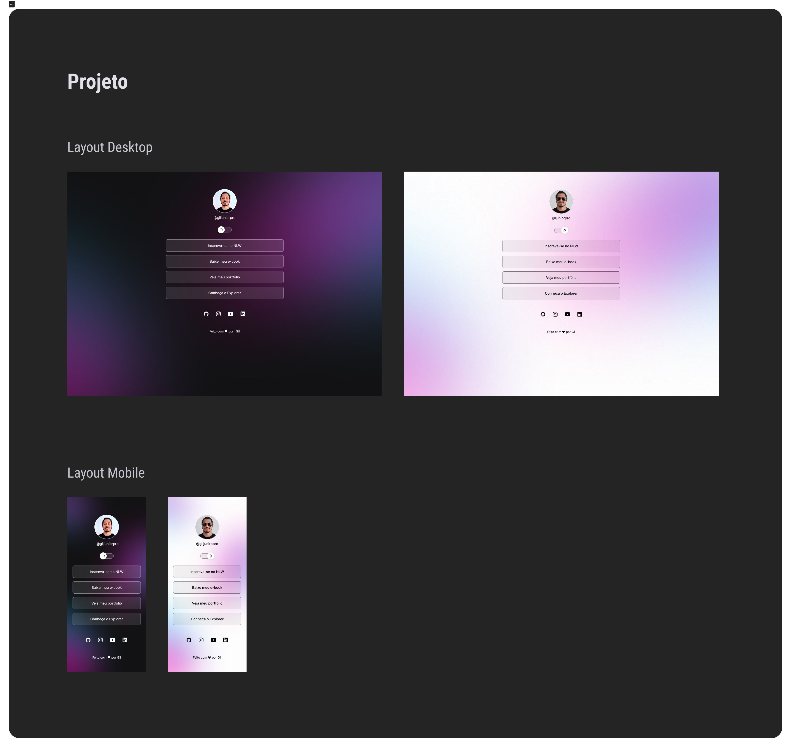

<h1 align="center"> GilLinks </h1>

Projeto exclusivo e gratuito, promovido por Gil para o próprio ensino de tecnologias WEB.

  <a href="#-tecnologias">Tecnologias</a>&nbsp;&nbsp;&nbsp;|&nbsp;&nbsp;&nbsp;
  <a href="#-projeto">Projeto</a>&nbsp;&nbsp;&nbsp;|&nbsp;&nbsp;&nbsp;
  <a href="#-layout">Layout</a>&nbsp;&nbsp;&nbsp;|&nbsp;&nbsp;&nbsp;
  <a href="#memo-licença">Licença</a>

  

 

  

## 🚀 Tecnologias

Esse projeto foi desenvolvido com as seguintes tecnologias:

- HTML e CSS
- JavaScript
- Git e Github
-Figma

## 💻 Projeto

O GilLinks é um agregador de links para usar como cartão de visitas online.

## 🔖 Layout

Você pode visualizar o layout do projeto através [DESSE LINK](https://www.figma.com/design/vxHvMjG8StzsqFYl3Ii4mn/Gillinks-%E2%80%A2-Projeto-Discover--Community-?node-id=0-1&t=1K58DUGVqolPWD1a-1). É necessário ter conta no [Figma](https://figma.com) para acessá-lo.

## :memo: Licença

Esse projeto está sob a licença MIT.

---

Feito com ♥ by Gil :wave: [Participe da nossa comunidade!](https://discord.gg/rocketseat)
# PRO-MG-LINKS
